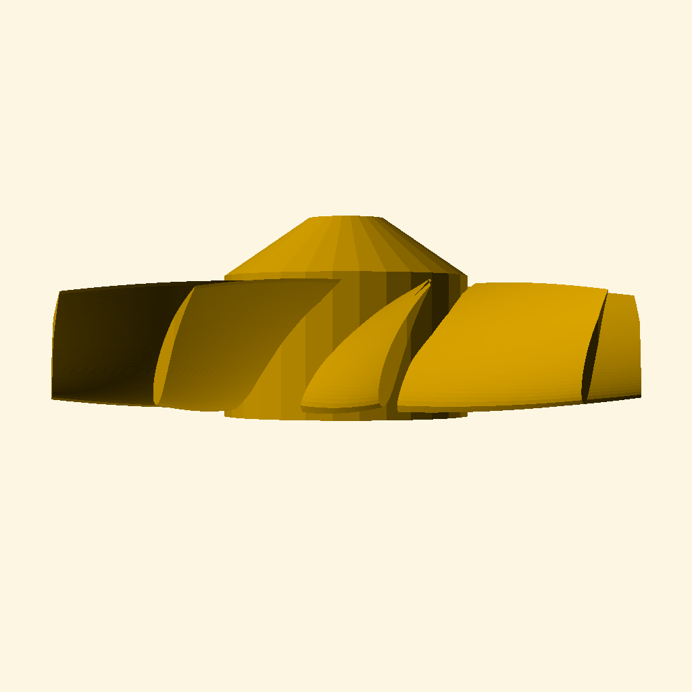
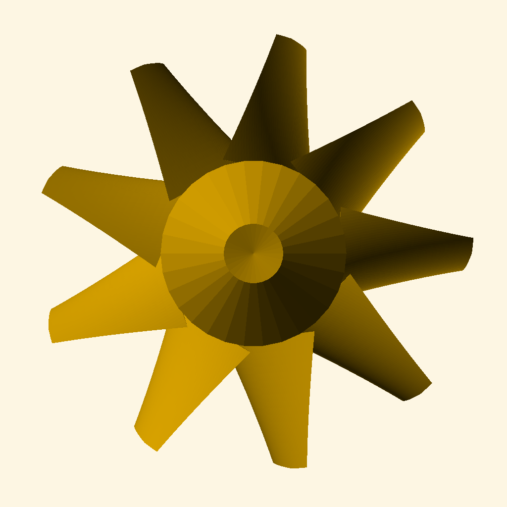

# FanGrill-OpenSCAD: Parametric Turbomachinery Framework

[](https://github.com/Sparlode/fan-grill-openSCAD/actions/workflows/design_automation.yml)

An advanced engineering-first framework for generating parametric axial fans and protective stator grills. Designed for high-fidelity procedural CAD generation, this repository provides an automated pipeline for Design of Experiments (DoE) and geometric validation.

| Front View | Top View |
| :---: | :---: |
|  |  |

## 🛠 Engineering Architecture

### 1. Aerodynamic Rotor Modeling
The rotor implementation (`fan_rotor_eng.scad`) moves beyond simple geometric primitives to utilize true aerodynamic profiles:
*   **NACA 4-Digit Airfoils:** Profiles are generated algorithmically using mathematical list comprehensions and coordinate transformations.
*   **Non-Linear Swept Extrusions:** Blades are constructed using `linear_extrude` with dynamically calculated `twist` and `scale` arguments to simulate pitch change and taper from hub to tip.
*   **Hub Intersections:** Precise boolean `intersection()` operations ensure clean blade-to-hub transitions without manifold errors.

### 2. Parametric Stator Design
The stator grill (`fan_grill_eng.scad`) focuses on structural integrity and airflow optimization:
*   **Algorithmic Radial Layouts:** Utilizes polar coordinate mapping and `for` loops to generate concentric support rings and radial vanes.
*   **Minkowski Smoothing:** Selective use of Minkowski sums and hull operations to create smooth fillets at high-stress mounting points.

### 3. Separation of Concerns (SoC)
The codebase is structured for programmatic control:
*   **Logical Modules:** Implementation is decoupled into `rotor/`, `stator/`, and `assemblies/`.
*   **Parameter Injection:** A dedicated `fan_parameters.scad` serves as the interface for the Python DoE script, allowing for safe, non-mutating parameter overrides.

## 🚀 Design Space Exploration & Automation

This repository is built to function as a **Parametric Design Factory**.

### Design of Experiments (DoE)
The pipeline utilizes a Python driver (`src/scripts/generate_doe.py`) to execute a systematic DoE matrix. It explores the design space by varying:
- Blade Count & Pitch
- Hub-to-Tip Ratios
- NACA Profile Thickness
- Grill Mesh Density

### Automated Workflow
1.  **JSON Manifest:** `src/config.json` defines the design space boundaries.
2.  **CLI Execution:** The Python script drives OpenSCAD in headless mode (`openscad -o ... -D ...`).
3.  **Artifact Generation:** Each iteration produces:
    - `.stl`: High-resolution mesh for geometry processing.
    - `.png`: Standardized orthographic and perspective renders for computer vision.
    - `.json`: Ground-truth labels for each specific design variation.

## 📂 Repository Structure

```text
├── .github/workflows/  # CI/CD: Automated design validation and variant generation
├── src/
│   ├── cad/            # Engineering logic (Rotor, Stator, Utils)
│   ├── scripts/        # Python DoE & automation drivers
│   └── parameters/     # Global constraints & project metadata
├── docs/
│   └── wiki/           # Detailed engineering & design documentation
└── dist/               # Generated datasets (STL, Images, Metadata)
```

## 💻 Getting Started

### Prerequisites
- [OpenSCAD](https://openscad.org/) (Added to PATH)
- Python 3.10+

### Execution
Generate the complete engineering dataset:
```bash
python src/scripts/generate_doe.py
```
The results will be available in the `dist/` directory, ready for engineering review and simulation.
